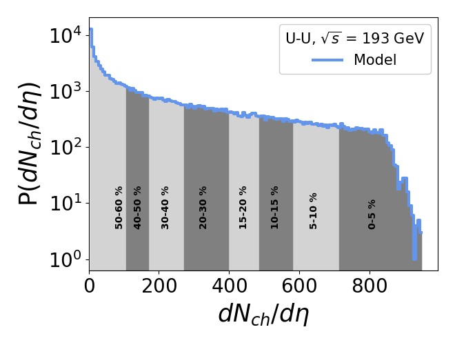

# Analysis

A number of scripts are provided here to generate 
[plots](plot) of Glauber model outputs.

## Pre-requisites

Use either Linux package manager or `pip` to install
the dependencies,

```shell
pip3 install argparse numpy h5py scipy matplotlib
```

## Usage

Invoke these scripts in the following way. Here `--output`
or `-o` is optional - `stdout` is redirected to output
file(s) if given - first one is usually the path for the
plotted image.

```shell
./script -i /path/to/input(s) -o /path/to/output(s)
```

For example, [nch_dist.py](nch_dist.py) plots charged particle
multiplicity distribution at mid-rapidity with centrality
divisions and calculates centrality-wise information of
model quantities that can be saved in plain text,

```shell
./nch_dist.py -i /path/to/input(s) -o plot.png div.dat
```

## Add New Script

Modify the [template](template.py) script to add new functionality.
Refer to the scripts already provided for insights. Note
that all relevant quantities are stored under "Glauber"
group within the output file.

## Plots

Below are some plots compared between Optical and Monte
Carlo Glauber calculations for U+U collision at 193 GeV.

| Optical | Monte Carlo |
| ------------- | ------------- |
|  |  |
|  |  |
|  |  |